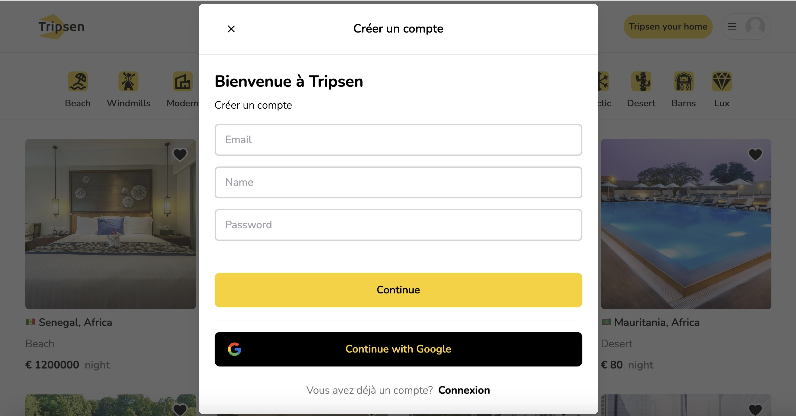

# Full Stack booking application with Next.js 13 App Router: React, Tailwind, Prisma, MongoDB, NextAuth 2023
|       |      |
|------------|-------------|
| | |

## Il s'agit d'un référentiel pour un booking Full Stack avec le routeur d'application Next.js 13 : React, Tailwind, Prisma, MongoDB, NextAuth.

# Features:

Table, like this one :

First Header  | Second Header | Second Header
------------- | ------------- | -------------
Content Cell  | Content Cell  | Content Cell
Content Cell  | Content Cell  | Content Cell

```bash
Tailwind design
```
. Tailwind design
Tailwind animations and effects
Full responsiveness
Credential authentication
Google authentication
Github authentication
Image upload using Cloudinary CDN
Client form validation and handling using react-hook-form
Server error handling using react-toast
Calendars with react-date-range
Page loading state
Page empty state
Booking / Reservation system
Guest reservation cancellation
Owner reservation cancellation
Creation and deletion of properties
Pricing calculation
Advanced search algorithm by category, date range, map location, number of guests, rooms and bathrooms
For example we will filter out properties that have a reservation in your desired date range to travel
Favorites system
Shareable URL filters
Lets say you select a category, location and date range, you will be able to share URL with a logged out friend in another browser and they will see the same results
How to write POST and DELETE routes in route handlers (app/api)
How to fetch data in server react components by directly accessing database (WITHOUT API! like Magic!)
How to handle files like error.tsx and loading.tsx which are new Next 13 templating files to unify loading and error handling
How to handle relations between Server and Child components!

Open [http://localhost:3000](http://localhost:3000) with your browser to see the result.

You can start editing the page by modifying `app/page.tsx`. The page auto-updates as you edit the file.

This project uses [`next/font`](https://nextjs.org/docs/basic-features/font-optimization) to automatically optimize and load Inter, a custom Google Font.

## Learn More

To learn more about Next.js, take a look at the following resources:

- [Next.js Documentation](https://nextjs.org/docs) - learn about Next.js features and API.
- [Learn Next.js](https://nextjs.org/learn) - an interactive Next.js tutorial.

You can check out [the Next.js GitHub repository](https://github.com/vercel/next.js/) - your feedback and contributions are welcome!

## Deploy on Vercel

